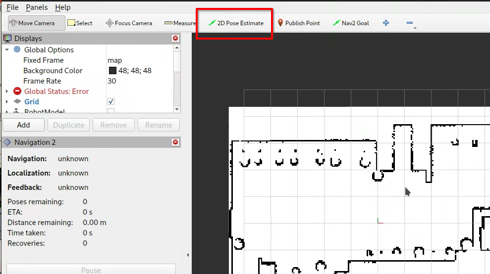
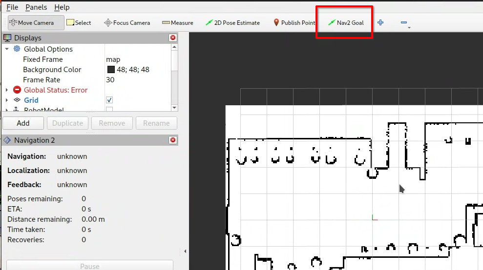
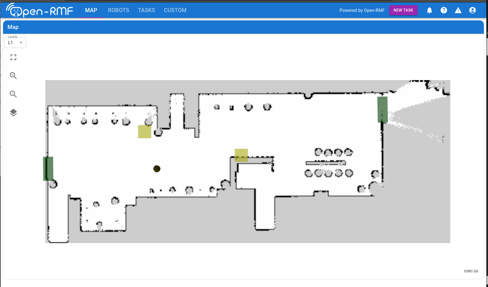
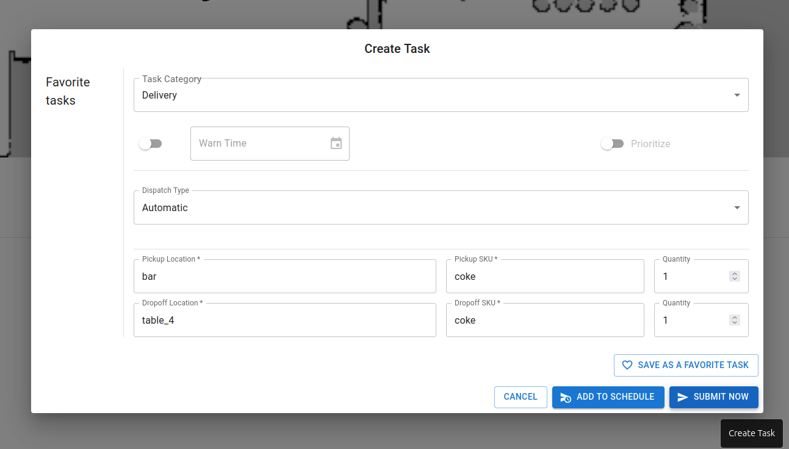

# ionic_demo
Ionic demo world and resources


Usage:

```
git clone https://github.com/gazebosim/ionic_demo
cd ionic_demo/ionic_demo/worlds
gz sim -v 4 ionic.sdf
```

In Harmonic:
```
sudo apt install ros-rolling-ros-gz
```

# Running the navigation demo


This demo requires at least [ROS 2 Jazzy](https://docs.ros.org/en/jazzy/index.html).

Create a new colcon workspace, install dependencies and build the packages,

```
mkdir -p ~/ionic_ws/src
cd ~/ionic_w/src
git clone https://github.com/gazebosim/ionic_demo

source /opt/ros/jazzy/setup.bash
rosdep install --from-paths src --ignore-src --rosdistro $ROS_DISTRO -y

cd ~/ionic_ws/
colcon build
```

Launch the demo,

```
source ~/ionic_ws/install/setup.bash
ros2 launch ionic_demo ionic_navigation_demo_launch.py headless:=0
```

On rviz, initialize the position at the origin towards the right of the map, using the `2D Pose Estimate button`.



Navigation commands can now be sent via the `Nav2 Goal` button.



# Running the Open-RMF demo

In order to minimize race conditions, we recommend running each launch file one after the other.

Start the dashboard docker image,

```
docker run --network host -it --rm \
  -e RMF_SERVER_URL=http://localhost:8000 \
  -e TRAJECTORY_SERVER_URL=http://localhost:8006 \
  ghcr.io/gazebosim/ionic_demo_rmf_dashboard:main
```

Start the API server docker image, make sure to note the `ROS_DOMAIN_ID` and `RMW_IMPLEMENTATION`. This starts the API server on `localhost:8000`.

```
docker run --network host -it --rm \
  -e ROS_DOMAIN_ID=<ROS_DOMAIN_ID> \
  -e RMW_IMPLEMENTATION=<RMW_IMPLEMENTATION> \
  ghcr.io/open-rmf/rmf-web/api-server:rolling
```
The dashboard will be accessible at `localhost:3000` by default.

Spawn the world and arm,

```
ros2 launch ionic_demo ionic_moveit_demo_launch.py
```

Spawn the turtlebot4, start its nav2 stack, moveit plugin for the arm, and all other Open-RMF related nodes. This also lets the fleet adapter know to communicate with the API server on `localhost:8000/_internal`.

```
ros2 launch ionic_demo ionic_rmf_demo_launch.py server_uri:="ws://localhost:8000/_internal"
```

Dispatch delivery or patrol tasks via `rmf-web`.




Or dispatch the delivery task manually,

```
ros2 run rmf_demos_tasks dispatch_delivery -p bar -ph moveit_dispenser -d table_4 -dh coke_ingestor --use_sim_time -st 0
```

# Troubleshooting

* If there are communication/middleware related issues while running the demos, we recommend trying again [using a different RMW implementation](https://docs.ros.org/en/jazzy/How-To-Guides/Working-with-multiple-RMW-implementations.html#specifying-rmw-implementations), for example `rmw_cyclonedds_cpp`.
